# Restoran-website
The restaurant's responsive site has 8 pages: Home, About, Services, Menu, Reservation, Our team, Testimonials and Contact. Visitors can learn about the restaurant's history, services, menu, book, meet the team, read testimonials and get in touch easily.

# Home
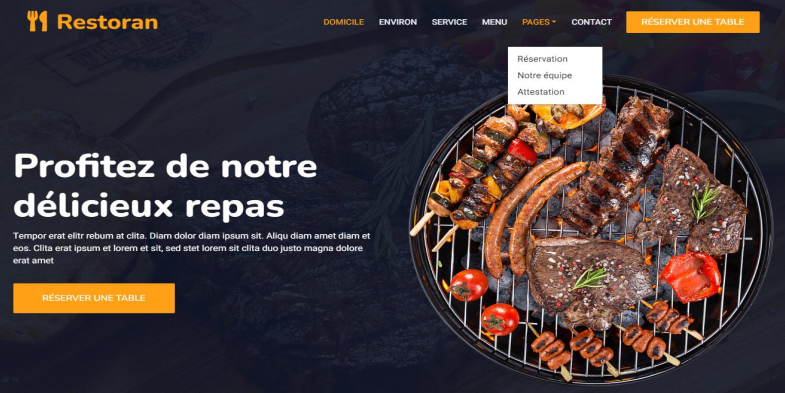
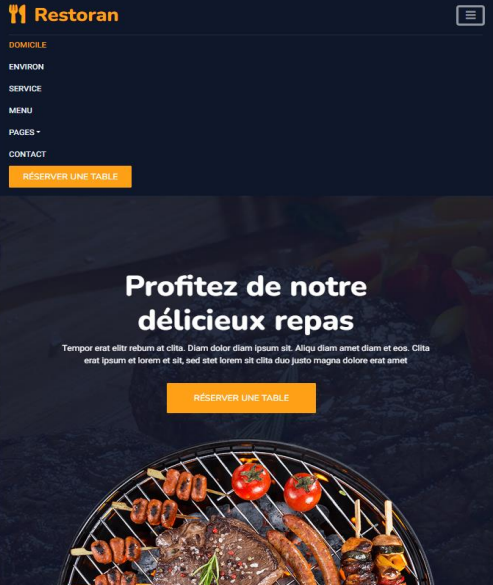

# Footer
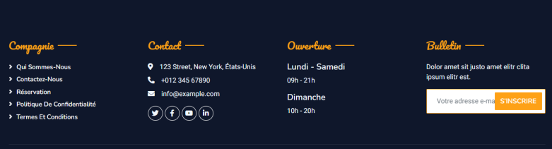
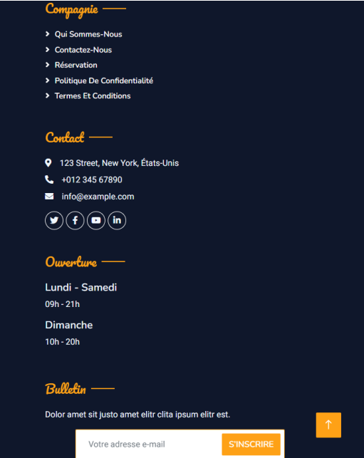

# About
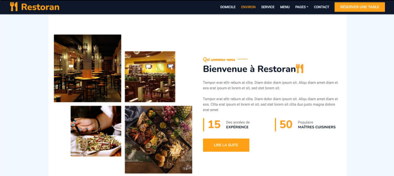
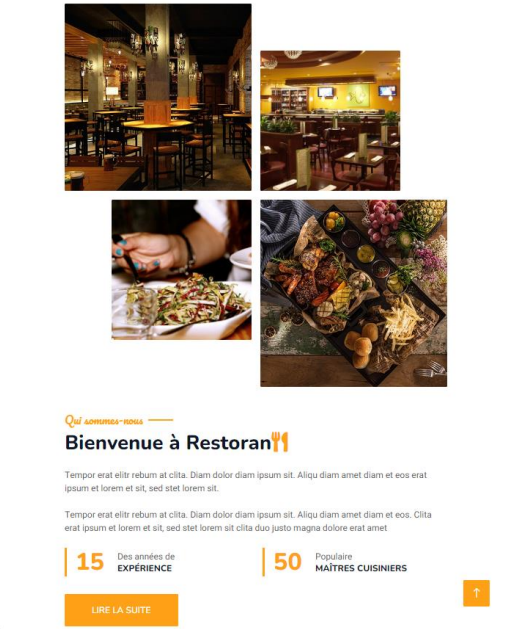

# Service

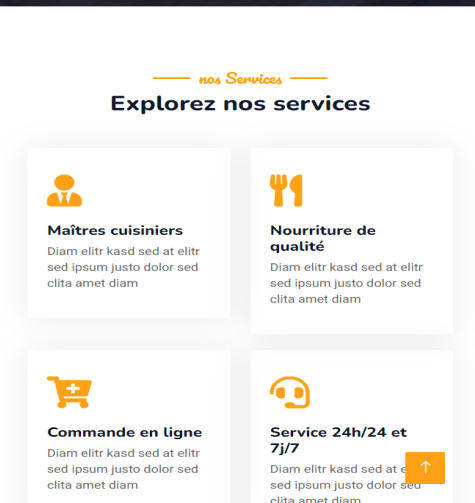

# Menu
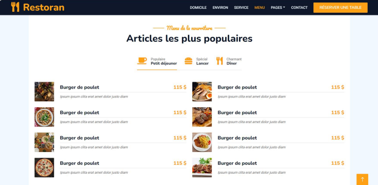
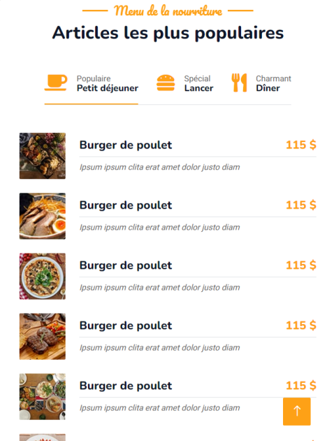

# Reservation
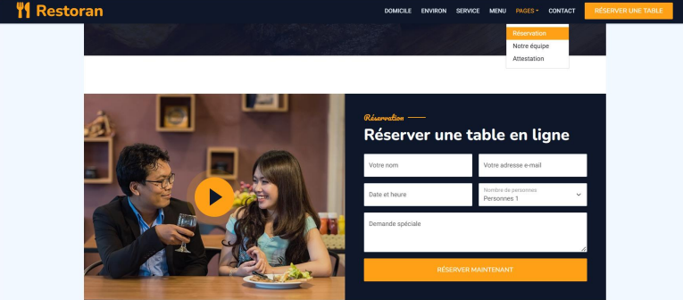
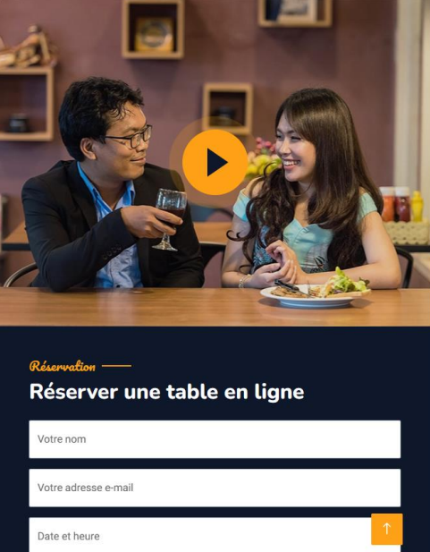

# Our team
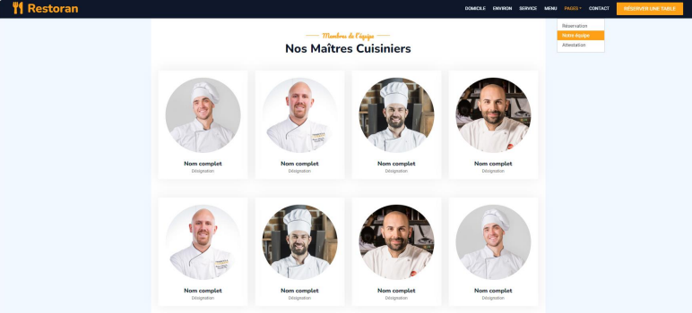
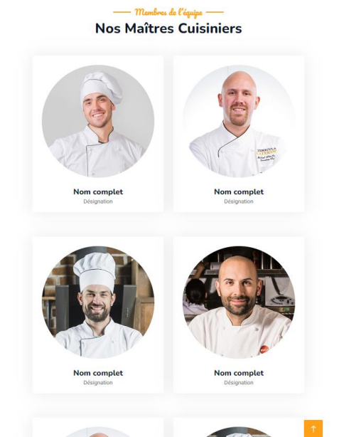

# Comment
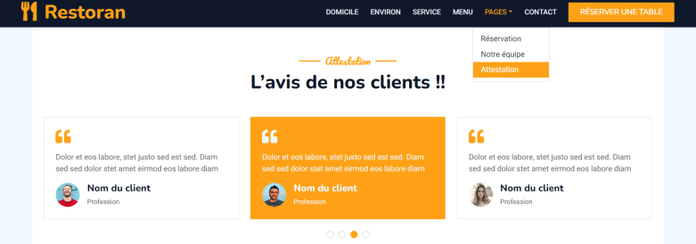
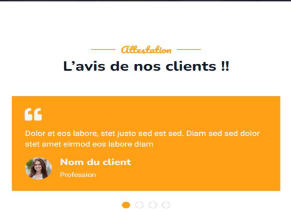

# Contact
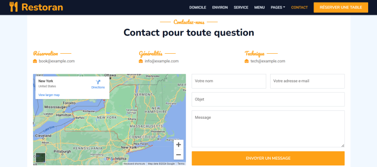
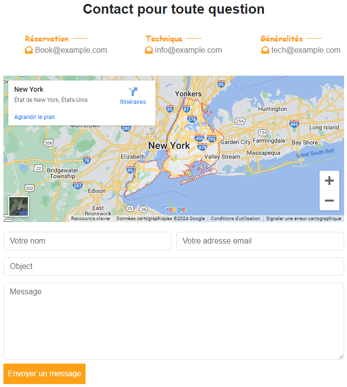
